# PES-VCS — Custom Version Control System

### Name: Piyush G Nadgir

### SRN: PES1UG24AM190

---

## Introduction

This project implements a lightweight Version Control System in C, inspired by Git’s internal design. The system focuses on efficient storage of file data, tracking changes over time, and maintaining a structured commit history. Instead of relying on filenames, it uses content-based identification to manage data.

---

## Core Design Concepts

* **Content-Based Storage:**
  Each file is stored using its SHA-256 hash, ensuring identical content is saved only once.

* **Safe File Updates:**
  File writes follow a temporary file → rename approach to prevent corruption during failures.

* **Optimized Object Storage:**
  Objects are distributed across subdirectories to reduce lookup overhead.

* **Change Detection:**
  File metadata such as modification time and size is used to quickly detect updates.

---

## Implementation Stages and Outputs

### Stage 1: Object Storage

**Test Execution Output**
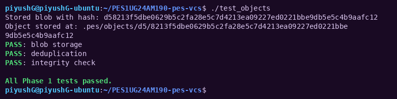

This verifies correct creation of blob objects and ensures duplicate content is not stored multiple times.

**Object Directory Layout**
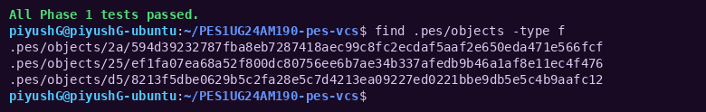

Shows how objects are distributed across directories for efficient access.

---

### Stage 2: Tree Representation

**Tree Construction Validation**
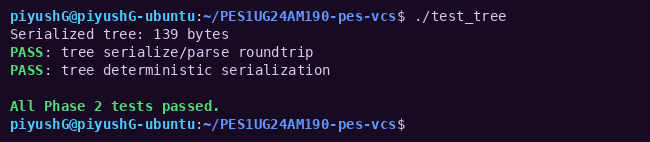

Confirms correct building and parsing of hierarchical directory structures.

**Binary Format Inspection**
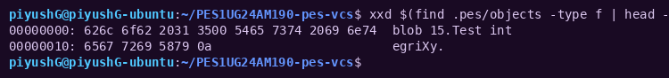

Displays the internal binary layout of tree objects using a hex dump.

---

### Stage 3: Index (Staging Mechanism)

**Status Command Output**
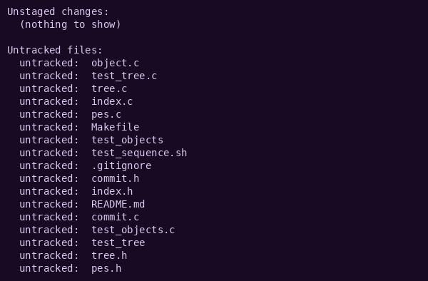

Demonstrates how staged files are tracked before committing.

**Index File Contents**
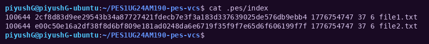

Shows stored metadata and object references inside the index file.

---

### Stage 4: Commit Handling and History

**Commit Log Output (View 1)**
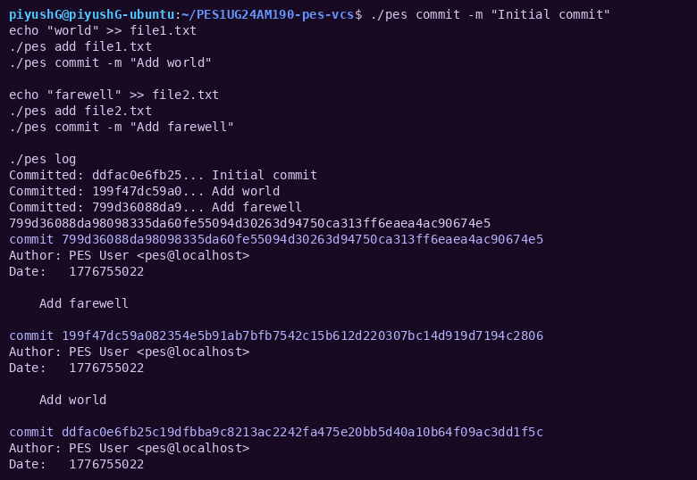

**Commit Log Output (View 2)**
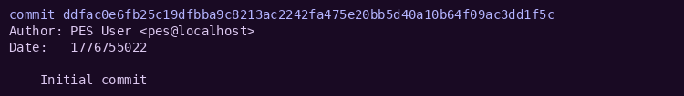

These outputs confirm that commits are linked correctly, forming a history chain.

**Object Store Growth**
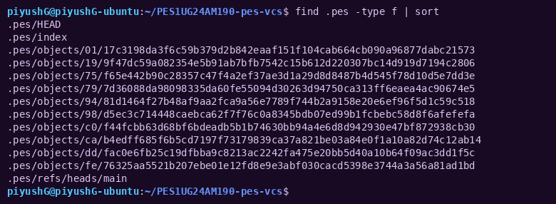

Illustrates how new commits increase stored objects.

**HEAD Reference Tracking**
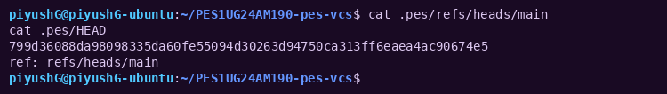

Shows how the latest commit is referenced.

**Integration Testing Output**
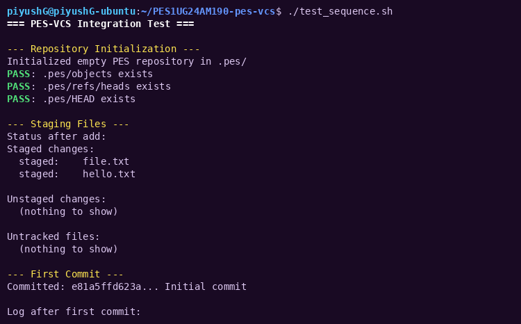

Additional views:
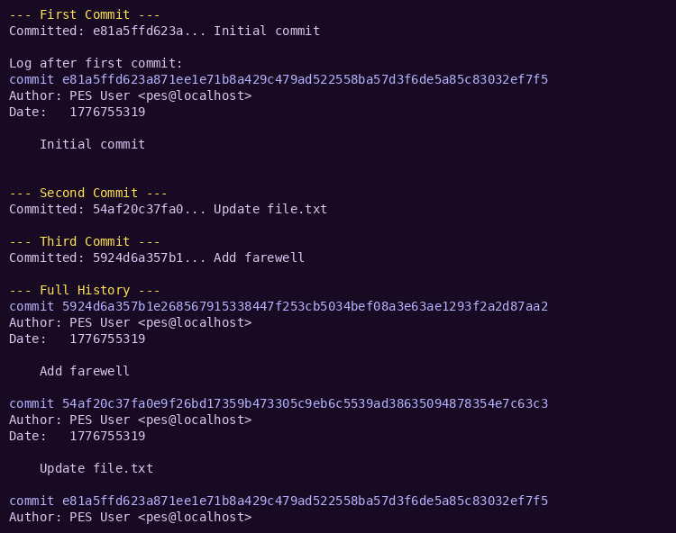
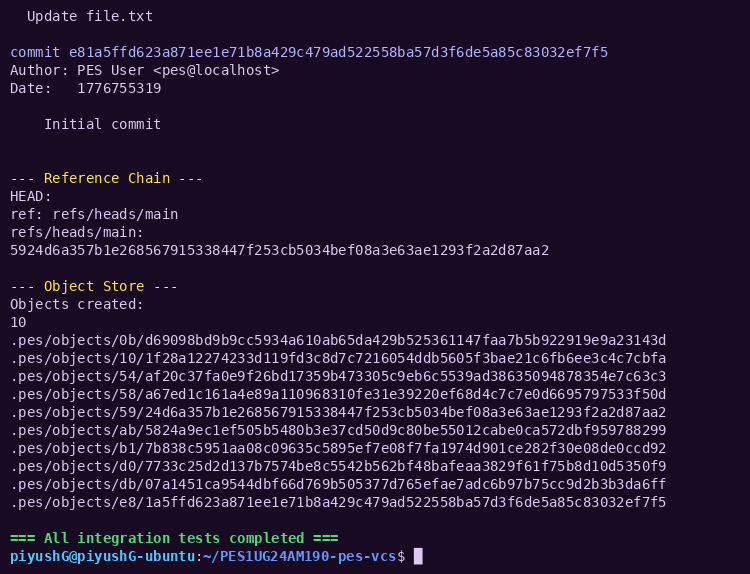

---

## Conceptual Questions

### Branch Switching (Checkout)

To switch branches, the system updates the HEAD reference to point to the selected branch. The working directory is then synchronized with the corresponding commit’s tree structure. Care must be taken to avoid overwriting uncommitted changes, which requires comparing current files with the target state.

---

### Detecting Uncommitted Changes

The system compares file metadata (modification time and size) with stored index entries. Any mismatch indicates that the working directory has been modified. Additionally, comparing hashes with the target commit helps identify differences.

---

### Detached HEAD State

When operating in a detached HEAD state, commits are created without updating any branch pointer. These commits still exist in the object store and can be recovered by referencing their hash.

---

## Garbage Collection Strategy

### Reachability Analysis

A mark-and-sweep approach is used:

* Start from HEAD and branch references
* Recursively mark all reachable objects
* Remove any unreferenced objects

---

### Concurrency Concerns

If garbage collection runs while new objects are being created, there is a risk of deleting valid but unreferenced data. This can be mitigated by delaying deletion of recently created objects.

---

## Execution Instructions

```bash
make pes
./pes init
./pes add <filename>
./pes commit -m "commit message"
```
